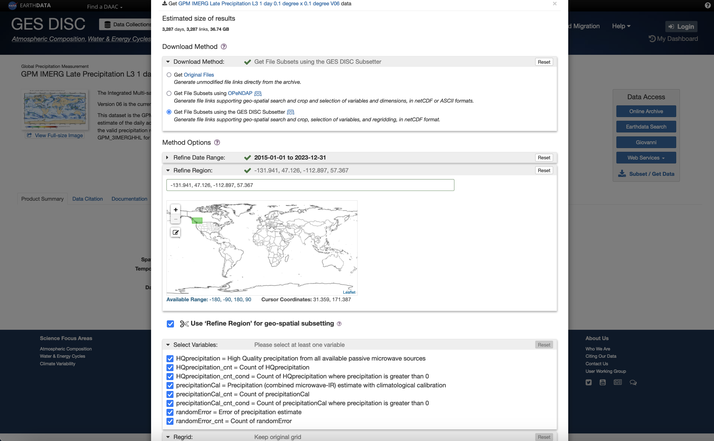

# GeoPipeline-StarterKit

## Description

A walkthrough on retrieving datasets from [NASA Earthdata](https://urs.earthdata.nasa.gov/home), as well as a template to create machine learning models that use precipitation data in the vicinity of hydroelectric dams to predict resevoir levels and subsequent dam output capcity.

## Modules Used

- `pandas`: A powerful Python data analysis toolkit, ideal for data manipulation and cleaning.
- `notebook`: Jupyter Notebooks provides an interactive environment for your data processing and visualization tasks.
- `xarray`: A Python library for data processing. It’s built upon numpy and `pandas` (and `dask`) libraries to use and process the data in the manner you want.
- `netcdf4`: This is a bare-bones library for working with NetCDF data (i.e. the `.nc4` extension), which is the format of the precipitation data from GES DISC used in this repository.
- `matplotlib`: A versatile Python library for creating customizable data visualizations and plots.
- `seaborn`: A data visualization library that provides an aesthetically pleasing and informative way to create statistical graphics.

## Device Requirements

- This project was completed on MacOS, and some of the scripts (ex. `download-earthdata-from-urls-file.sh`) assume use on a MacOS/Linux system (ex. the use of `curl` vs. `wget`). Some minor modifications will be required to run all steps on a Windows device.
- The data downloaded in this walkthrough will require just under 2 GB of disk space:
  - 660 MB for the GES DISC precipitation dataset
  - 1.21 GB for the uncompressed reservoir levels database

## Getting Started

### 1. Retrieve hydroelectric dam data

#### Retrieve dam coordinates

This is necessary as a first step to narrow down the coordinates for the following step of percipitation data retrieval.

For this demonstration, a list of BC Hydro dams and their respective coordinates, capacities and year of construction has been retrieved from Wikipedia (see [List of generating stations in British Columbia](https://en.wikipedia.org/wiki/List_of_generating_stations_in_British_Columbia)).

This data has been manually transformed into a CSV (see [BC Hydro dams as of 2024-01-01](./input/bc-hydro-dam-coordinates/bc-hydro-dams-as-of-2024-01-01.csv)).

#### Determine coordinates (bounding box) for the precipitation dataset

See the [dam-coordinates notebook](./notebooks/dam-coordinates.ipynb) to define a buffer size (in kms) around the outermost dams. The output of this notebook will provide an input for data retrieval when selecting precipitation data.

Example output for the [BC Hydro dams as of 2024-01-01](./input/bc-hydro-dam-coordinates/bc-hydro-dams-as-of-2024-01-01.csv) with a 100km buffer size:

```python
[-131.206, 47.576, -113.633, 56.917]
```

#### Retrieve data for resevoir levels

##### Download the HYDAT reservoir DB

The Government of Canada's [National Water Data Archive: HYDAT page](https://www.canada.ca/en/environment-climate-change/services/water-overview/quantity/monitoring/survey/data-products-services/national-archive-hydat.html) includes a [link](https://collaboration.cmc.ec.gc.ca/cmc/hydrometrics/www/) to a page with an SQLite database containing relevant resevoir water levels.

Download [the SQLite database](https://collaboration.cmc.ec.gc.ca/cmc/hydrometrics/www/Hydat_sqlite3_20231120.zip) and the [associated documentation](https://collaboration.cmc.ec.gc.ca/cmc/hydrometrics/www/HYDAT_Definition_EN.pdf).

Extract the compressed database file (`Hydat.sqlite3`) and move it to the path `input/hydat-db/`. You may want to use a free and open source SQLite tool such as [DB Browser for SQLite](https://sqlitebrowser.org/dl/).

##### Query the appropriate reservoirs

Running the following queries on the DB has been helpful in finding reservoirs relevant to BC Hydro.

Find BC Hydro's `AGENCY_ID` (equivalent to the `CONTRIBUTOR_ID` in the `STATIONS` table):

```sql
SELECT AGENCY_ID
FROM AGENCY_LIST
WHERE AGENCY_EN = 'BRITISH COLUMBIA HYDRO AND POWER AUTHORITY';
-- Output: 75
```

Find the `Active` `STATUS_CODE` (equivalent to `HYD_STATUS` in the `STATIONS` table).

```sql
SELECT STATUS_CODE
FROM STN_STATUS_CODES
WHERE STATUS_EN = 'Active'
-- Output: 'A'
```

Find the stations with BC Hydro's `CONTRIBUTOR_ID` which are also active:

```sql
SELECT *
FROM STATIONS
WHERE CONTRIBUTOR_ID = 75 AND HYD_STATUS = 'A'
```

#### Validate the queried reservoirs

It would be useful to ensure that our reservoirs are:

1. Located within BC, as expected
1. Found within the previously defined bounding box that will be used to filter the precipitation dataset in a subsequent step.

##### Determine the total number of selected reservoirs

```sql
SELECT COUNT(*)
FROM STATIONS
WHERE CONTRIBUTOR_ID = 75 AND HYD_STATUS = 'A'
-- Output: 84
```

##### Validate reservoirs are within the province of BC

```sql
SELECT COUNT(*)
FROM STATIONS
WHERE CONTRIBUTOR_ID = 75 AND HYD_STATUS = 'A'
AND PROV_TERR_STATE_LOC = 'BC'
-- Expected Output: 84
```

##### Validate reservoirs are within the previously defined bounding box

```sql
SELECT COUNT(*)
FROM STATIONS
WHERE CONTRIBUTOR_ID = 75 AND HYD_STATUS = 'A'
AND LONGITUDE BETWEEN -131.206 AND -113.633
AND LATITUDE BETWEEN 47.576 AND 56.917;
-- Expected Output: 84
-- Actual Output: 83
```

It can be seen that at one of the reservoirs is outside of our bounding box, which was buffered by 100km. It's worth not considering whether to exclude that reservoir from further analysis, or to expand the bounding box.

The following query can be used to determine which reservoir falls outside of the current bounding box:

```sql
SELECT STATION_NUMBER, STATION_NAME, LATITUDE, LONGITUDE
FROM STATIONS
WHERE CONTRIBUTOR_ID = 75 AND HYD_STATUS = 'A'
AND (LONGITUDE < -131.206 OR LONGITUDE > -113.633 OR LATITUDE < 47.576 OR LATITUDE > 56.917);
-- Output:
-- STATION_NUMBER STATION_NAME                  LATITUDE        LONGITUDE
-- 07EA005        FINLAY RIVER ABOVE AKIE RIVER	57.126220703125	-125.249923706055
```

Further investigation of the [Finlay River](https://en.wikipedia.org/wiki/Finlay_River) and [the coordinates of this reservoir](https://www.google.com/maps/place/57%C2%B007'34.4%22N+125%C2%B014'59.7%22W/@56.9182314,-125.266649,9.11z/data=!4m4!3m3!8m2!3d57.1262222!4d-125.2499167?entry=ttu) shows that it may be a relevant reservoir to include in the dataset, as it feeds into [Williston Lake](https://en.wikipedia.org/wiki/Williston_Lake), a reservoir created by the [W.A.C. Bennett Dam](https://en.wikipedia.org/wiki/W._A._C._Bennett_Dam).

The W.A.C. Bennett Dam is currently [the second-highest capacity dam in all of British Columbia](https://en.wikipedia.org/wiki/List_of_generating_stations_in_British_Columbia), so it would be best to keep this reservoir and the precipitation in its surrounding area within the bounding box.

Thus, using the `dam-coordinates` notebook (mentioned earlier in the [section describing how to determine the bounding box coordinates](#determine-coordinates-bounding-box-for-the-precipitation-dataset)), we can extend the bounding box buffer to 150km, to get a new set of coordinates in the [asdf](#select-an-dataset-based-on-the-desired-characteristics):

```python
[-131.941, 47.126, -112.897, 57.367]
```

The new upper-bound latitude of 57.367 now contains the previously excluded reservoir. We can now perform one final validation to ensure that all expected reservoirs are found within the new coordinates:

```sql
SELECT COUNT(*)
FROM STATIONS
WHERE CONTRIBUTOR_ID = 75 AND HYD_STATUS = 'A'
AND LONGITUDE BETWEEN -131.941 AND -112.897
AND LATITUDE BETWEEN 47.126 AND 57.367;
-- Expected Output: 84
-- Actual Output: 84
```

At this point, it is safe to say that these 84 reservoirs and the current bounding box (with a 150km buffer size) are acceptable to proceed with.

### 2. NASA Earthdata account setup

#### Create your NASA Earthdata account

See [here](https://disc.gsfc.nasa.gov/data-access).

#### Link your account with GES DISC

1. See [here](https://disc.gsfc.nasa.gov/earthdata-login).
2. Verify `NASA GESDISC DATA ARCHIVE` is listed in your [Earthdata Authorized Apps](https://urs.earthdata.nasa.gov/users/jonathanearthdata/authorized_apps) page.

### 3. Choose appropriate Earthdata dataset

#### Define the desired characteristics of the dataset

The hope was to find a Global Precipitation Management Integrated Multi-satellitE Retrievals (GPM IMERG) dataset with these characteristics:

- Data Latency: Late
- Spatial Resolution: L3
- Temporal Resolution: 1 Day

#### Select a dataset based on the desired characteristics

Use the [Goddard Earth Sciences Data and Information Services Center (GES DISC) data collections search](https://disc.gsfc.nasa.gov/) to find an appropriate dataset.

The Earthdata (GES DISC) precipitation dataset idenfied as suitable for this repository based on the above characteristics is:

- **GPM IMERG Late Precipitation L3 1 day 0.1 degree x 0.1 degree V06 (`GPM_3IMERGDL`)**
  - [Summary](https://disc.gsfc.nasa.gov/datasets/GPM_3IMERGDL_06/summary)
  - [README](https://gpm1.gesdisc.eosdis.nasa.gov/data/GPM_L3/doc/README.GPM.pdf)

### 4. Downloading the Earthdata dataset

Since the aforementioned dataset is not checked into this repository, you will need to download it yourself by performing the following steps:

#### Setup Earthdata prerequisite files

- Follow the instructions at: [GES DISC - How to Generate Earthdata Prerequisite Files](https://disc.gsfc.nasa.gov/information/howto?title=How%20to%20Generate%20Earthdata%20Prerequisite%20Files)

#### Fill in the download form

Select the appropriate coordinates in the download form. These coordinates were first defined in a [previous section](#determine-coordinates-bounding-box-for-the-dataset) with an initial buffer size of 100km, but were then [re-defined after extending the bounding box to include all relevant reservoirs with a 150km buffer size](#validate-reservoirs-are-within-the-previously-defined-bounding-box) from the outermost dam coordinates:

```python
[-131.941, 47.126, -112.897, 57.367]
```

Select an appropriate date range and all variables in the Earthdata download form. By selecting all variables now, they can then be omitted from the selected features when training the model if they are determined to be irrelevant. The "regrid" options can be left with default settings, as well.



#### Download the Earthdata URLs

Once the form has valid values selected, a set of URLs will be generated as a downloadable text file, which will be utilized in one of the following steps to download all appropriate files in the dataset.

The precipitation dataset used in this example has its URL file saved [here](./input/earthdata-ges-disc/urls/subset_GPM_3IMERGDL_06_20240102_235953_.txt).

#### Download the Earthdata dataset (official documentation)

Once the prerequisite files have been set up, and the URLs file has been downloaded, it is recommended that you review the official instructions on using `wget` or `curl` to download all URLs in the previously downloaded URLs text file:

- [GES DISC - How to Access GES DISC Data Using wget and curl](https://disc.gsfc.nasa.gov/information/howto?title=How%20to%20Access%20GES%20DISC%20Data%20Using%20wget%20and%20curl)

#### Download the Earthdata dataset (streamlined approach)

Alternatively, [a script that uses `curl`](./download-earthdata-from-urls-file.sh) has been created to streamline this process, allowing easy selection of the URLs file and the output directory for all files that will be downloaded.

Review the script, ensuring the `urls_file` and `output_dir` variables are set as desired. Then, run it:

```sh
./download-earthdata-from-urls-file.sh
```

By default, the downloaded files will be saved to the the target path: [input/earthdata-ges-disc/dataset](./input/earthdata-ges-disc/dataset).

### 5. Build a Model

See the [pre-processing notebook](./notebooks/pre-processing.ipynb). This is currently a work in progress, and more will be added soon!

## References

1. [How to Query and Use NASA Geo-Data for Your Next Data Science Project](https://medium.com/@sirmammingtonham/how-to-query-and-use-nasa-geo-data-for-your-next-data-science-project-27aef13c93d2) by [Ethan Joseph](https://medium.com/@sirmammingtonham)
1. [Getting NASA data for your next geo-project](https://towardsdatascience.com/getting-nasa-data-for-your-next-geo-project-9d621243b8f3) by [Karan Bhanot](https://medium.com/@bhanotkaran22)
1. [Wikipedia: Hydroelectric stations owned by BC Hydro](https://en.wikipedia.org/wiki/List_of_generating_stations_in_British_Columbia)
1. [Goddard Earth Sciences Data and Information Services Center (GES DISC) data collections search](https://disc.gsfc.nasa.gov/)
1. [GES DISC - GPM IMERG Late Precipitation L3 1 day 0.1 degree x 0.1 degree V06 (GPM_3IMERGDL) - Summary](https://disc.gsfc.nasa.gov/datasets/GPM_3IMERGDL_06/summary)
1. [GES DISC - GPM IMERG Late Precipitation L3 1 day 0.1 degree x 0.1 degree V06 (GPM_3IMERGDL) - README](https://gpm1.gesdisc.eosdis.nasa.gov/data/GPM_L3/doc/README.GPM.pdf)
1. [GES DISC - How to Access GES DISC Data Using wget and curl](https://disc.gsfc.nasa.gov/information/howto?title=How%20to%20Access%20GES%20DISC%20Data%20Using%20wget%20and%20curl)
1. [GES DISC - How to Generate Earthdata Prerequisite Files](https://disc.gsfc.nasa.gov/information/howto?title=How%20to%20Generate%20Earthdata%20Prerequisite%20Files)
1. [National Water Data Archive: HYDAT](https://www.canada.ca/en/environment-climate-change/services/water-overview/quantity/monitoring/survey/data-products-services/national-archive-hydat.html)
1. [HYDAT file downloads](https://collaboration.cmc.ec.gc.ca/cmc/hydrometrics/www/)
1. [HYDAT database documentation](https://collaboration.cmc.ec.gc.ca/cmc/hydrometrics/www/HYDAT_Definition_EN.pdf)
1. [Wikipedia - Finlay River](https://en.wikipedia.org/wiki/Finlay_River)
1. [Wikipedia - Williston Lake](https://en.wikipedia.org/wiki/Williston_Lake)
1. [Wikipedia - W.A.C. Bennett Dam](https://en.wikipedia.org/wiki/W._A._C._Bennett_Dam)
1. [Read and analyze netCDF4 files with xarray in python](https://medium.com/@buzulan.petru/read-and-analyze-netcdf4-files-with-xarray-in-python-1c714fad8a66) by [Petru Buzulan](https://medium.com/@buzulan.petru)
